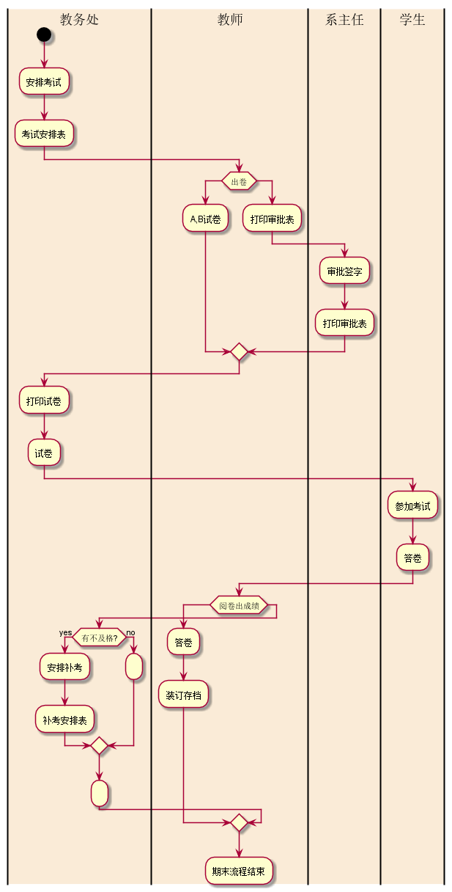
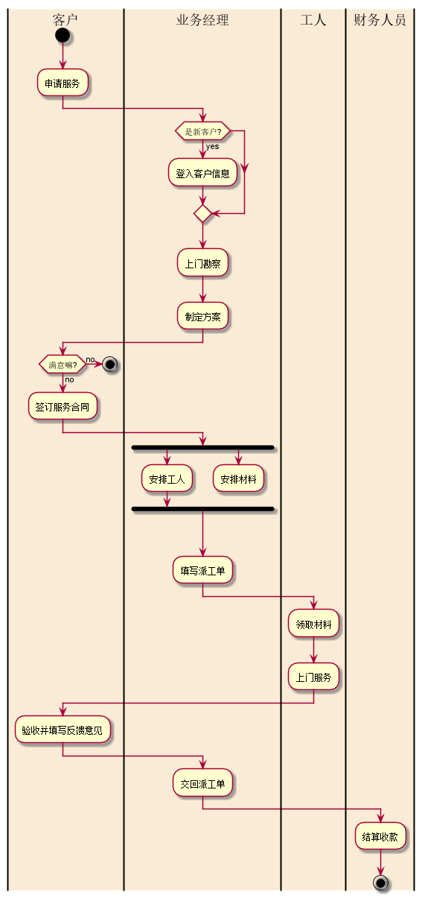

# 实验1：业务流程建模
|学号|班级|姓名|照片|
|:-------:|:-------------: | :----------:|:---:|
|201610414405|软件(本)16-4|程瑞||

## 流程图1：考试及成绩管理流程

**PlantUML源码如下：**

``` flow1
@startuml
|教务处|
start
:安排考试;
:考试安排表;
|#AntiqueWhite|教师|
if (出卷) then
  :A,B试卷;
else
  :打印审批表;
    |#AntiqueWhite|系主任|
    :审批签字;
    :打印审批表;
endif
 |#AntiqueWhite|教务处|
 :打印试卷;
 :试卷;
|#AntiqueWhite|学生|
:参加考试;
:答卷;
|#AntiqueWhite|教师|
if (阅卷出成绩) then
  :答卷;
  :装订存档;
else
 |#AntiqueWhite|教务处|
   if (有不及格?) then (yes)
     :安排补考;
     :补考安排表;
   else (no)
     :;
   endif
    :;
 endif
 |#AntiqueWhite|教师|
  :期末流程结束;


@enduml
```

**业务流程图如下：**



**流程说明：**
教务处安排考试，排成考试表，等待老师出卷，之后审核，签字后，交于学生考试，阅卷出结果，是否有不及格的学生，安排补考。


## 流程图2： 客户维修服务流程

**PlantUML源码如下：**

``` flow2
@startuml
|客户|
start
:申请服务;
|#AntiqueWhite|业务经理|
 if (是新客户?) then (yes)
     :登入客户信息;
   endif
    :上门勘察;
    :制定方案;
 |#AntiqueWhite|客户|
  if (满意嘛?) then (no)
      stop
    else (no)
       :签订服务合同;
       |#AntiqueWhite|业务经理|
       fork
           :安排工人;
         fork again
           :安排材料;
           detach
         endfork;
    endif
     :填写派工单;
|#AntiqueWhite|工人|
 :领取材料;
 :上门服务;
|#AntiqueWhite|客户|
 :验收并填写反馈意见;
|#AntiqueWhite|业务经理|
 :交回派工单;
|#AntiqueWhite|财务人员|
 :结算收款;
stop
@enduml
```

**业务流程图如下：**


**流程说明：** 客户申请服务，经理判断是否为新用户，登入信息，制定方案，看客户是都满意，满意的话就可以开始安排工人，材料，安排哪一个工作人员，领取材料，上门服务，验收并反馈，收回派工单，结账。


