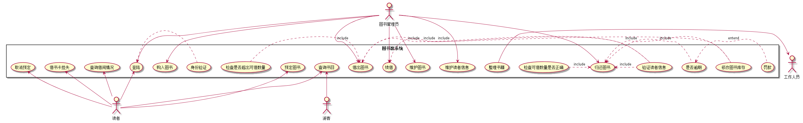
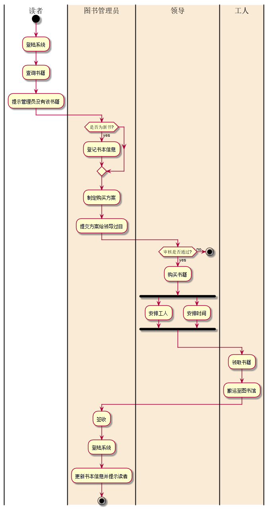

# 实验2：图书管理系统用例建模
|学号|班级|姓名|照片|
|:-------:|:-------------: | :----------:|:---:|
|201610414405|软件(本)16-4|程瑞|
## 1. 图书管理系统的用例关系图

### 1.1 用例图PlantUML源码如下：

``` usecase
@startuml
actor 图书管理员
actor 读者
actor 工作人员
rectangle 图书馆系统 {
图书管理员 -> (登陆)
图书管理员 -> (借出图书)
(借出图书) <. (验证读者信息): include
(检查是否超出可借数量) .> (借出图书) : include
(借出图书) <.(修改图书库存): include
图书管理员 -> (续借)
(续借) <. (验证读者信息): include
(归还图书) <- 图书管理员
(归还图书) <.(是否逾期): include
(是否逾期) <.(罚款): entend
(整理书籍) -> (工作人员)
(归还图书) <. (验证读者信息): include
(检查可借数量是否正确) .> (归还图书) : include
(归还图书) <.(修改图书库存): include
图书管理员 --> (维护图书)
图书管理员 --> (维护读者信息)
(查询书目) <-- 读者
(查询借阅情况) <--读者
(预定图书) <--读者
(取消预定) <- 读者
(借书卡挂失) <-读者
(登陆) <- 读者
(身份验证) .>(登陆)
}
@enduml

```


### 1.2. 用例图如下：



## 2. 参与者说明：

###     2.1 图书管理员

主要职责是：验证读者信息，进行图书的借出，归还整理以及续借，检查读者是否逾期并进行罚款，
维护图书的信息等。

###     2.2 读者

主要职责是：查询图书是否课借出，查找书籍，预定书籍以及取消预定等。

###     2.3 工作人员
    
主要职责是：整理书籍

##     3. 用例规约表

###     3.1 “借出图书”用例  
<table>
   <tr>
      <td>用例名称</td>
      <td>借出图书</td>
   </tr>
   <tr>
      <td>参与者</td>
      <td>图书管理员</td>
   </tr>
   <tr>
      <td>前置条件</td>
      <td>1.读者登陆到系统<br>
            2.管理员登陆到系统</td>
   </tr>
   <tr>
      <td>后置条件</td>
      <td>产生新的借书信息</td>
   </tr>
   <tr>
      <td>主流事件</td>
   </tr>
   <tr>
      <td>参与者动作</td>
      <td>系统行为</td>
   </tr>
   <tr>
      <td>
      1.管理员选择需要借书的读者；<br>
      3.管理员查询读者信息，剩余借书量<br>
      5.管理员选择书籍；<br>
      7.管理员查询书籍是否达到借书数量；<br>
      9.管理员借出图书。</td>
      <td>2.系统列出需要借书的读者；<br>
      4.系统显示读者的信息，剩余借书量<br>
      6.系统显示书籍；<br>
      8.系统显示书籍剩余数量；<br>
      10.系统刷新书籍数量并保存。</td>
   </tr>
   
   <tr>
      <td>备选事件流</td>
       <td></td>
   </tr>
   <tr>
      <td>
       3a.没有借书量<br>&nbsp&nbsp 
       1.系统提示管理员该读者没有借书量。<br>
       7a.借书数量达到上限<br>&nbsp&nbsp
       1.系统提示管理员书籍达到上限</td><td></td>
   </tr>
   <tr>
      <td>业务规则</td><td></td>
   </tr>
   <tr>
      <td>1.一个读者可以有多次借书，直到借书数量达到上限，或者有逾期行为则不能再进行借书操作。<br>
          2.借出书本数量不能超过书本本身的数量。</td><td></td>
   </tr>
</table>

###     3.2 “购入图书”用例

<table>
   <tr>
      <td>用例名称</td>
      <td>购入图书</td>
   </tr>
   <tr>
      <td>参与者</td>
      <td>1.图书管理员<br>2.领导<br>3.工人<br>4.读者</td>
   </tr>
   <tr>
      <td>前置条件</td>
      <td>1.读者登陆到系统<br>
             2.管理员登陆到系统</td>
   </tr>
   <tr>
      <td>后置条件</td>
      <td>产生新的购买信息</td>
   </tr>
   <tr>
      <td>主流事件</td>
   </tr>
   <tr>
      <td>参与者动作</td>
      <td>系统行为</td>
   </tr>
   <tr>
      <td>
      1.读者登入系统，查询书籍；<br>
      3.读者提示管理员没有该书籍。管理员查询书籍是否为新书；<br>
      5.管理员制定购买书籍的方案；<br>
      6.管理员提交方案给领导过目；<br>
      7.领导进行审核过目；<br>
      8.审核通过进行购买，安排工人，安排时间；<br>
      9.工人领取书籍，搬运至图书馆；<br>
      10.管理员签收，并登入新书信息。</td>
      <td>2.系统列出书本信息并提示读者没有该书籍；<br>
      4.系统书本信息。<br>
      11.系统更新新书信息，保存并提示读者。
      </td>
   </tr>
   
   <tr>
      <td>备选事件流</td>
       <td></td>
   </tr>
   <tr>
      <td>
       6a.审核不通过<br>&nbsp&nbsp 
       1.管理员重新制定或修改购买方案。<br>
       </td><td></td>
   </tr>
   <tr>
      <td>业务规则</td><td></td>
   </tr>
   <tr>
      <td>1.一次购买书籍，雇佣的工人数量最少10人，最多不超过20人。<br>
          </td><td></td>
   </tr>
</table>

**“购入图书”用例流程图源码如下：**
``` uc1_flow
@startuml
|读者|
start
:登陆系统;
:查询书籍;
:提示管理员没有该书籍;
|#AntiqueWhite|图书管理员|
 if (是否为新书?) then (yes)
     :登记书本信息;
   endif
    :制定购买方案;
    :提交方案给领导过目;
 |#AntiqueWhite|领导|
 if (审核是否通过?) then (yes)
     :购买书籍;
      fork
           :安排工人;
         fork again
           :安排时间;
           endfork;
       else(no)
       stop
    endif
|#AntiqueWhite|工人|
:领取书籍;
:搬运至图书馆;
|#AntiqueWhite|图书管理员|
:签收;
:登陆系统;
:更新书本信息并提示读者;
stop
@enduml
```

**“购入图书”用例流程图源码如下：**



###     3.3 “续借”用例

<table>
   <tr>
      <td>用例名称</td>
      <td>续借</td>
   </tr>
   <tr>
      <td>参与者</td>
      <td>1.图书管理员<br>2.读者</td>
   </tr>
   <tr>
      <td>前置条件</td>
      <td>1.读者登陆到系统<br>
       2.管理员登陆到系统</td>
   </tr>
   <tr>
      <td>后置条件</td>
      <td>产生新的借书信息</td>
   </tr>
   <tr>
      <td>主流事件</td>
   </tr>
   <tr>
      <td>参与者动作</td>
      <td>系统行为</td>
   </tr>
   <tr>
      <td>
      1.管理员登入系统；<br>
      2.进入续借功能<br>
      3.管理员确定读者信息，并查看是否有逾期； <br>
      5.管理员确定续借书籍；<br></td>
      <td>4.系统显示读者信息；<br>
      6.系统显示书籍信息。<br>
      7.系统更新信息，并保存。
      </td>
   </tr>
   
   <tr>
      <td>备选事件流</td>
       <td></td>
   </tr>
   <tr>
      <td>
       3a.逾期则不通过<br>&nbsp&nbsp 
       1.管理员提示读者已逾期，需要交罚款。<br>
       </td><td></td>
   </tr>
   <tr>
      <td>业务规则</td><td></td>
   </tr>
   <tr>
      <td>1.一个读者可以有多次借书，直到借书数量达到上限，或者有逾期行为则不能再进行借书操作。<br>
                    2.借出书本数量不能超过书本本身的数量。<br>
          </td><td></td>
   </tr>
</table>

###     3.4 “还书”用例

<table>
   <tr>
      <td>用例名称</td>
      <td>续借</td>
   </tr>
   <tr>
      <td>参与者</td>
      <td>1.图书管理员<br>2.读者</td>
   </tr>
   <tr>
      <td>前置条件</td>
      <td>1.读者登陆到系统<br>
       2.管理员登陆到系统</td>
   </tr>
   <tr>
      <td>后置条件</td>
      <td>产生新的借书信息</td>
   </tr>
   <tr>
      <td>主流事件</td>
   </tr>
   <tr>
      <td>参与者动作</td>
      <td>系统行为</td>
   </tr>
   <tr>
      <td>
      1.管理员登入系统；<br>
      2.进入续借功能<br>
      3.管理员确定读者信息，并查看是否有逾期； <br>
      5.管理员确定书籍信息，书籍是否完好。<br></td>
      <td>4.系统显示读者信息；<br>
      6.系统显示书籍信息。<br>
      7.系统更新信息，并保存。
      </td>
   </tr>
   
   <tr>
      <td>备选事件流</td>
       <td></td>
   </tr>
   <tr>
      <td>
       3a.逾期则不通过<br>&nbsp&nbsp 
       1.管理员提示读者已逾期，需要交罚款。<br>
       5a.书籍有损坏<br>&nbsp&nbsp 
       1.管理员提示读者书籍有损坏，需要交罚款。
       </td><td></td>
   </tr>
   <tr>
      <td>业务规则</td><td></td>
   </tr>
   <tr>
      <td>1.一个读者可以有多次借书，直到借书数量达到上限，或者有逾期行为则不能再进行借书操作。<br>
                    2.借出书本数量不能超过书本本身的数量。<br>
          </td><td></td>
   </tr>
</table>

###     3.5 “查询书籍”用例

<table>
   <tr>
      <td>用例名称</td>
      <td>查询书籍</td>
   </tr>
   <tr>
      <td>参与者</td>
      <td>1.读者 <br>2.管理员</td>
   </tr>
   <tr>
      <td>前置条件</td>
      <td>1.读者登陆到系统</td>
   </tr>
   <tr>
      <td>后置条件</td>
      <td>无</td>
   </tr>
   <tr>
      <td>主流事件</td>
   </tr>
   <tr>
      <td>参与者动作</td>
      <td>系统行为</td>
   </tr>
   <tr>
      <td>
      1.读者登入系统；<br>
      2.进入查询图书功能<br>
      3.读者查询图书； <br></td>
      <td>4.是否有图书，有就系统显示图书的信息；<br>
      </td>
   </tr>
   
   <tr>
      <td>备选事件流</td>
       <td></td>
   </tr>
   <tr>
      <td>
       4a.没有图书<br>&nbsp&nbsp 
       1.系统显示没有该图书,并提示读者是否预定书籍。<br>
       5.读者进行预定或取消预定功能。
       </td><td></td>
   </tr>
   <tr>
      <td>业务规则</td><td></td>
   </tr>
   <tr>
      <td>1.一本书籍有书的编号，书名，作者，出版日期，当前借阅状态信息等。<br>
          </td><td></td>
   </tr>
</table>


###     3.6 “借书卡挂失”用例

<table>
   <tr>
      <td>用例名称</td>
      <td>借书卡挂失</td>
   </tr>
   <tr>
      <td>参与者</td>
      <td>1.读者 <br>2.管理员</td>
   </tr>
   <tr>
      <td>前置条件</td>
        <td>1.读者登陆到系统<br>
         2.管理员登陆到系统</td>
   </tr>
   <tr>
      <td>后置条件</td>
      <td>无</td>
   </tr>
   <tr>
      <td>主流事件</td>
   </tr>
   <tr>
      <td>参与者动作</td>
      <td>系统行为</td>
   </tr>
   <tr>
      <td>
      1.读者登入系统；<br>
      2.进入借书卡挂失功能<br>
      3.读者确定自己的信息； <br></td>
      <td>4.系统确认读者信息，并进行挂失。<br>
      </td>
   </tr>
   
   <tr>
      <td>备选事件流</td>
       <td></td>
   </tr>
   <tr>
      <td>
       4a.挂失后系统提示读者是否进行补办<br>&nbsp&nbsp 
       1.补办，确定读者信息，并打印。<br>
       </td><td></td>
   </tr>
   <tr>
      <td>业务规则</td><td></td>
   </tr>
   <tr>
      <td>1.一个读者只有一个借书卡，借书卡显示读者的姓名，编号等信息。<br>
          </td><td></td>
   </tr>
</table>

