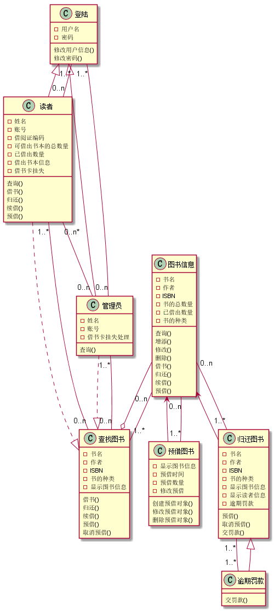
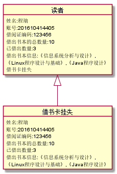
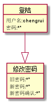
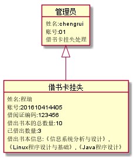
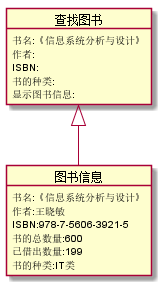
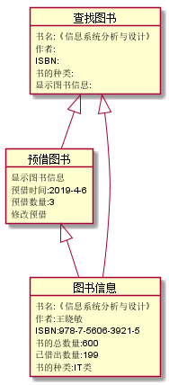
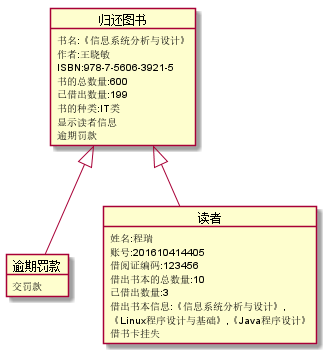

# 实验3：图书管理系统领域对象建模
|学号|班级|姓名|照片|
|:-------:|:-------------: | :----------:|:---:|
|201610414405|软件(本)16-4|程瑞|
## 1. 图书管理系统的类图

### 1.1 类图PlantUML源码如下：

``` class
@startuml

abstract class 图书信息
abstract 查找图书
interface 预借图书
interface 登陆
interface 读者
interface 管理员
interface 归还图书
interface 逾期罚款
逾期罚款 --|> 归还图书
图书信息 --o  查找图书
图书信息 <--  预借图书
图书信息 <--  归还图书
登陆 <|-- 管理员
登陆 <|-- 读者
管理员 ..|> 查找图书
读者 ..|> 查找图书
登陆 "1..*" -- "0..n" 管理员
登陆 "1..*" -- "0..n" 读者
查找图书 "1..*" -- "0..n" 图书信息
预借图书 "1..*" -- "0..n" 图书信息
归还图书 "1..*" -- "0..n" 图书信息
归还图书 "1..*" -- "1..*" 逾期罚款
读者 "0..n*" -- "0..n" 管理员
读者 "1..*" -- "0..n"  查找图书
管理员"1..*" -- "0..n" 查找图书
class 图书信息 {
-书名
-作者
-ISBN
-书的总数量
-已借出数量
-书的种类
查询()
增添()
修改()
删除()
借书()
归还()
续借()
预借()
}

class 登陆 {
-用户名
-密码
修改用户信息()
修改密码()
}

class 查找图书 {
-书名
-作者
-ISBN
-书的种类
-显示图书信息
借书()
归还()
续借()
预借()
取消预借()

}

class 预借图书 {
-显示图书信息
-预借时间
-预借数量
-修改预借
创建预借对象()
修改预借对象()
删除预借对象()
}

class 读者{
-姓名
-账号
-借阅证编码
-可借出书本的总数量
-已借出数量
-借出书本信息
-借书卡挂失
查询()
借书()
归还()
续借()
预借()
}

class 管理员{
-姓名
-账号
-借书卡挂失处理
查询()
}

class 归还图书 {
-书名
-作者
-ISBN
-书的种类
-显示图书信息
-显示读者信息
-逾期罚款
预借()
取消预借()
交罚款()
}

class 逾期罚款 {
交罚款()
}
@enduml
```

### 1.2. 类图如下：



### 1.3. 类图说明：
读者和管理员只有通过账号密码登陆才能进行操作，是多对一的关系。<br>
读者和管理员通过查找图书才能获取到图书的信息，是依赖关系，当中一个读者或者管理员可以多次进行查询图书功能，也是一对多的关系。<br>
查找图书可以多次查看图书信息，是一对多的关系，并且是聚合关系。<br>
预借图书也可以多次查看图书信息，是一对多的关系。<br>
归还图书也可以多次查看图书信息，是一对多的关系。<br>
逾期罚款与归还的图书是一对一对应。


## 2. 图书管理系统的对象图
### 2.1 类 “读者”的对象图
#### 源码如下：
``` class
@startuml
object 读者{
姓名:程瑞
账号:201610414405
借阅证编码:123456
借出书本的总数量:10
已借出数量:3
借出书本信息:《信息系统分析与设计》,
《Linux程序设计与基础》,《Java程序设计》
借书卡挂失
}
读者 <|-- 借书卡挂失
object 借书卡挂失{
姓名:程瑞
账号:201610414405
借阅证编码:123456
借出书本的总数量:10
已借出数量:3
借出书本信息:《信息系统分析与设计》,
《Linux程序设计与基础》,《Java程序设计》
}

@enduml
``` 
#### 对象图如下：



### 2.2 类登陆的对象图
#### 源码如下：
``` class
@startuml

object 登陆 {
用户名:chengrui
密码:***********
}

@enduml
``` 
#### 对象图如下：



### 2.3 类管理员的对象图
#### 源码如下：
``` class
@startuml

object 管理员{
姓名:chengrui
账号:01
借书卡挂失处理
}
管理员 <|-- 借书卡挂失
object 借书卡挂失{
姓名:程瑞
账号:201610414405
借阅证编码:123456
借出书本的总数量:10
已借出数量:3
借出书本信息:《信息系统分析与设计》,
《Linux程序设计与基础》,《Java程序设计》
}

@enduml
``` 
#### 对象图如下：



### 2.4 类图书信息的对象图
#### 源码如下：
``` class
@startuml

object 图书信息 {
书名:《信息系统分析与设计》
作者:王晓敏
ISBN:978-7-5606-3921-5
书的总数量:600
已借出数量:199
书的种类:IT类
}

@enduml
``` 
#### 对象图如下：


### 2.5 类查找图书的对象图
#### 源码如下：
``` class
@startuml
object 查找图书 {
书名:《信息系统分析与设计》
作者
ISBN
书的种类
显示图书信息:
}
查找图书 <|-- 图书信息
object 图书信息 {
书名:《信息系统分析与设计》
作者:王晓敏
ISBN:978-7-5606-3921-5
书的总数量:600
已借出数量:199
书的种类:IT类
}
@enduml
``` 
#### 对象图如下：



### 2.5.1 对象图说明：
查找图书对象图中的查找功能只需输入书名，作者，ISBN，书的种类，
4个中任意一个就可以显示出符合信息的图书。

### 2.6 类预借图书的对象图
#### 源码如下：
``` class
@startuml

object 预借图书 {

显示图书信息
预借时间:2019-4-6
预借数量:3
修改预借

}

预借图书 <|-- 图书信息
查找图书 <|-- 预借图书
object 查找图书 {
书名:《信息系统分析与设计》
作者:
ISBN:
书的种类:
显示图书信息:
}
查找图书 <|-- 图书信息

object 图书信息 {
书名:《信息系统分析与设计》
作者:王晓敏
ISBN:978-7-5606-3921-5
书的总数量:600
已借出数量:199
书的种类:IT类
}

@enduml
``` 

#### 对象图如下：



### 2.7 类归还图书的对象图
#### 源码如下：
``` class
@startuml

object 归还图书 {
书名:《信息系统分析与设计》
作者:王晓敏
ISBN:978-7-5606-3921-5
书的总数量:600
已借出数量:199
书的种类:IT类
显示读者信息
逾期罚款
}
归还图书 <|-- 逾期罚款
object 逾期罚款 {
交罚款
}
object 读者{
姓名:程瑞
账号:201610414405
借阅证编码:123456
借出书本的总数量:10
已借出数量:3
借出书本信息:《信息系统分析与设计》,
《Linux程序设计与基础》,《Java程序设计》
借书卡挂失
}
归还图书 <|--读者
@enduml
``` 

#### 对象图如下：

