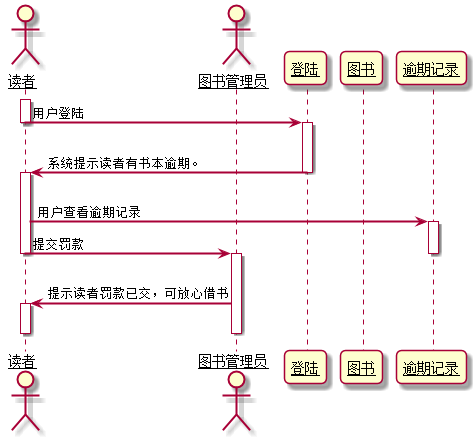

# 实验3：图书管理系统领域对象建模
|学号|班级|姓名|照片|
|:-------:|:-------------: | :----------:|:---:|
|201610414405|软件(本)16-4|程瑞|
## 图书管理系统的顺序图

## 1. 借书用例
## 1.1. 借书用例PlantUML源码

``` sequence
@startuml
skinparam sequenceArrowThickness 2
skinparam roundcorner 20
skinparam maxmessagesize 60
skinparam sequenceParticipant underline
actor 图书管理员
actor "读者" as a
participant "登陆" as b
participant "查找图书" as c
participant "图书" as d
participant "借书记录" as e

activate 图书管理员
图书管理员 -> b: 登陆系统
activate b
deactivate b
图书管理员 -> a: 验证读者信息，检查借书量
activate a
deactivate a
loop
图书管理员 -> c:查找图书
activate c
c-> d: 显示图书信息
deactivate c
activate d
d-> e: 生成借书记录
deactivate d
activate e
e-> d:更新图书信息
deactivate e
activate d
d-> a:更新读者信息
activate a
deactivate d
deactivate a
end
图书管理员 -> e:打印借书记录
activate e
deactivate e
图书管理员->a: 显示借书成功
activate a
deactivate a

@enduml
```

## 1.2. 借书用例顺序图


## 1.3. 借书用例顺序图说明
ABCDE....

***

## 2. 还书用例
## 2.1. 还书用例PlantUML源码

``` sequence
@startuml
skinparam sequenceArrowThickness 2
skinparam roundcorner 10
skinparam maxmessagesize 60
skinparam sequenceParticipant underline
actor 读者
actor 图书管理员
participant "登陆" as a
participant "图书" as b
participant "逾期记录" as c

activate 读者
读者 -> 图书管理员: 交还书本
deactivate 读者
activate 图书管理员
图书管理员 -> a: 验证读者信息
deactivate 图书管理员
activate a
a -> b:显示图书信息，并更新可借数量
activate 图书管理员
deactivate b
图书管理员 -> 读者:提示读者还书成功
activate 读者
deactivate 图书管理员
deactivate 读者
opt
a -> c:登记逾期记录
activate c
deactivate a
deactivate c
end


@enduml
```

## 2.2. 还书用例顺序图


## 2.3. 还书用例顺序图说明
ABCDE...
***
## 3. 续借用例
## 3.1. 续借用例PlantUML源码

``` sequence
@startuml
skinparam sequenceArrowThickness 2
skinparam roundcorner 20
skinparam maxmessagesize 60
skinparam sequenceParticipant underline
actor 图书管理员
actor "读者" as a
participant "登陆" as b
participant "图书" as c
participant "借书记录" as d
participant "逾期记录" as e

activate 图书管理员
图书管理员 -> b: 登陆系统
activate b
deactivate b
图书管理员 -> a: 验证读者信息
activate a
deactivate a
loop
activate c
c-> d: 生成借书记录
deactivate c
activate d
d-> a:更新读者信息
activate a
deactivate d
deactivate a
end
图书管理员 -> d:打印借书记录
activate d
deactivate d

图书管理员->a: 显示借书成功
activate a
deactivate a
opt
图书管理员 -> e:登记逾期记录
activate e
deactivate e
end
@enduml
```

## 3.2. 续借用例顺序图


## 3.3. 续借用例顺序图说明
ABCDE...
***
## 4. 罚款用例
## 4.1. 罚款用例PlantUML源码

``` sequence
@startuml
skinparam sequenceArrowThickness 2
skinparam roundcorner 10
skinparam maxmessagesize 60
skinparam sequenceParticipant underline
actor 读者
actor 图书管理员
participant "登陆" as a
participant "图书" as b
participant "逾期记录" as c

activate 读者
读者 -> a: 用户登陆
deactivate 读者
activate a
a -> 读者: 系统提示读者有书本逾期。
deactivate a
activate 读者
读者 -> c: 用户查看逾期记录
activate c

读者-> 图书管理员:提交罚款
deactivate 读者
deactivate c
activate 图书管理员
deactivate b
图书管理员 -> 读者:提示读者还书成功
activate 读者
deactivate 图书管理员
deactivate 读者
@enduml
```

## 4.2. 罚款用例顺序图


## 4.3. 罚款用例顺序图说明
ABCDE...
***
## 5. 预定图书用例
## 5.1. 预定图书用例PlantUML源码

``` sequence
@startuml
skinparam sequenceArrowThickness 2
skinparam roundcorner 20
skinparam maxmessagesize 60
skinparam sequenceParticipant underline
actor 图书管理员
actor "读者" as a
participant "登陆" as b
participant "查找图书" as c
participant "图书" as d

activate 图书管理员
图书管理员 -> b: 登陆系统
activate b
deactivate b
图书管理员 -> a: 验证读者信息，检查读者是否有逾期
activate a
deactivate a
loop
图书管理员 -> c:查找图书
activate c
c-> d: 显示图书信息
deactivate c
activate d
d-> d:更新图书信息
d-> a:更新读者信息
activate a
deactivate d

deactivate a
end
图书管理员->a: 显示预定成功
activate a
deactivate a

@enduml
```

## 5.2. 预定图书用例顺序图


## 5.3. 预定图书用例顺序图说明
ABCDE...
***
## 6. 取消预定用例
## 6.1. 取消预定用例PlantUML源码

``` sequence
@startuml
skinparam sequenceArrowThickness 2
skinparam roundcorner 20
skinparam maxmessagesize 60
skinparam sequenceParticipant underline
actor 图书管理员
actor "读者" as a
participant "登陆" as b
participant "查找图书" as c
participant "图书" as d

activate 图书管理员
图书管理员 -> b: 登陆系统
activate b
deactivate b
图书管理员 -> a: 验证读者信息
activate a
a->a:读取读者预定信息
loop
a -> c:查找图书
deactivate a
activate c
c-> d: 显示图书信息
deactivate c
activate d
d-> d:更新图书信息
d-> a:更新读者信息
activate a
deactivate d
deactivate a
end
图书管理员->a: 显示预定已取消
activate a
deactivate a

@enduml
```

## 6.2. 取消预定用例顺序图


## 6.3. 取消预定用例顺序图说明
ABCDE...
***
## 7. 借书卡挂失用例
## 7.1. 借书卡挂失PlantUML源码

``` sequence
@startuml
skinparam sequenceArrowThickness 2
skinparam roundcorner 20
skinparam maxmessagesize 60
skinparam sequenceParticipant underline
actor 图书管理员
actor "读者" as a
participant "登陆" as b
participant "挂失记录" as c

activate 图书管理员
图书管理员 -> b: 登陆系统
activate b
deactivate b
图书管理员 -> a: 验证读者信息
activate a
a->c:登记挂失记录
deactivate a
activate c
图书管理员 -> a:借书卡已挂失
activate a
deactivate c
deactivate a

@enduml
```

## 7.2. 借书卡挂失用例顺序图


## 7.3. 借书卡挂失用例顺序图说明
ABCDE...
***
## 8. 取消挂失用例
## 8.1. 取消挂失PlantUML源码

``` sequence
@startuml
skinparam sequenceArrowThickness 2
skinparam roundcorner 20
skinparam maxmessagesize 60
skinparam sequenceParticipant underline
actor 图书管理员
actor "读者" as a
participant "登陆" as b
participant "挂失记录" as c

activate 图书管理员
图书管理员 -> b: 登陆系统
activate b
deactivate b
图书管理员 -> a: 验证读者信息
activate a
a->c:取消挂失记录
deactivate a
activate c
图书管理员 -> a:借书卡挂失已取消
activate a
deactivate c
deactivate a

@enduml
```

## 8.2. 取消挂失用例顺序图


## 8.3. 取消挂失用例顺序图说明
ABCDE...
***