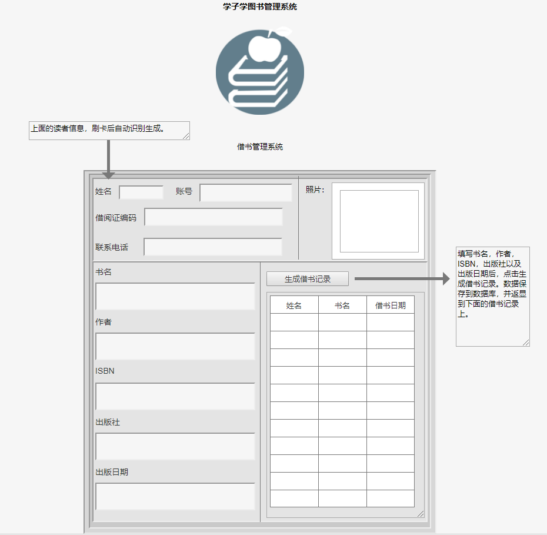

# 实验5：图书管理系统数据库设计与界面设计
|学号|班级|姓名|照片|
|:-------:|:-------------: | :----------:|:---:|
|201610414405|软件(本)16-4|程瑞|

## 1.数据库表设计

## 1.1. 图书表
|字段|类型|主键，外键|是否可为空|默认值|约束|说明|
|:-------:|:-------------:|:------:|:----:|:---:|:----:|:-----|
|ISBN|varchar(20)|主键|否||||
|书名|varchar(50)| |否||||
|作者|varchar(12)| |否||||
|书的种类|varchar(10)| |否||||
|已借出书本量|varchar(200)| |否| | |显示已经借出的书本数量|
|书本总数量|varchar(200)| |否| | |读者可以借出的书本总数量|
|出版社|varchar(100)| |是| | |可以不填写|
|出版日期|datetime| |是| | |可以不填写|
|简介|varchar(200)| |是| | |可以不填写|


## 1.2. 读者表
|字段|类型|主键，外键|可以为空|默认值|约束|说明|
|:-------:|:-------------:|:------:|:----:|:---:|:----:|:-----|
|姓名|varchar(10)|主键|否||||
|账号|varchar(12)| |否||||
|借阅证编码|varchar(12)| |否||||
|可借出书本的总数量|varchar(100)| |否||||
|累计借书|varcha(100)| |否||||
|联系电话|varchar(10)| |是| | |可以不填写|

## 1.3. 管理员表
|字段|类型|主键，外键|可以为空|默认值|约束|说明|
|:-------:|:-------------:|:------:|:----:|:---:|:----:|:-----|
|工号|varchar(10)|主键|否||||
|姓名|varchar(12)| |否||||
|性别|varchar(12)| |否||||
|联系电话|varchar(10)| |是||||

## 1.4. 借阅表
|字段|类型|主键，外键|可以为空|默认值|约束|说明|
|:-------:|:-------------:|:------:|:----:|:---:|:----:|:-----|
|工号|varchar(10)|主键|否||||
|ISBN|varchar(12)|外键|否||||
|读者姓名|varchar(12)| |否||||
|借书日期|varchar(10)| |是||||
|还书日期|varchar(12)| |否||||
|是否续借|varchar(10)| |是||||
***

## 2. 界面设计
## 2.1. 借书界面设计

- 用例图参见：借书用例
- 类图参见：借书类，读者类
- 顺序图参见：借书顺序图
- API接口如下：

1. 借书API

- 功能：用于读者进行借书
- 请求地址： http://180.84.27.95/v1/api/BorrowBooks
- 请求方法：POST
- 请求参数：

|参数名称|必填|说明|
|:-------:|:-------------: | :----------:|
|书名|是|得到图书信息 |
|作者|是|得到图书信息|
|ISBN|是|确认图书信息 |
|出版社|否| |
|出版日期|否|  |


- 返回实例：
```
{
    "info": "借阅成功！请按时归还书籍！信息已显示在借书记录框里！",
    "data": {
        "书名": "《信息系统分析与设计》",
        "作者": "王晓敏 ,
        "ISBN": "978-7-302-32982-4",
        "出版社": "清华大学出版社",
        "出版日期": "2013",
    },
    "code": 200
}
```
- 返回参数说明：
    
|参数名称|说明|
|:-------:|:-------------: |
|Info|返回信息|
|data|用户的个人信息|
|dodo|返回码|

2. *读者信息API
- 功能：用于获取全部分类
- 请求地址： http://180.84.27.95/v1/api/Borrower
- 请求方法：POST
- 请求参数：

|参数名称|必填|说明|
|:-------:|:-------------: | :----------:|
|姓名|是|确认读者信息|
|账号|是| 检验读者账号|
|借阅证编码|是| 检验借阅证编码与本人是否一致|
|联系电话|否| |
- 返回实例：
```
{
    "info": "感谢您的支持。",
    "data": {
        "姓名": "陈少义",
        "账号": "201610414404",
        "借阅证编码": "123456654",
        "联系电话": "11011011010",
    },
    "code": 200
}
```
- 返回参数说明：
    
|参数名称|说明|
|:-------:|:-------------: |
|Info|返回信息|
|data|用户的个人信息|
|dodo|返回码|
