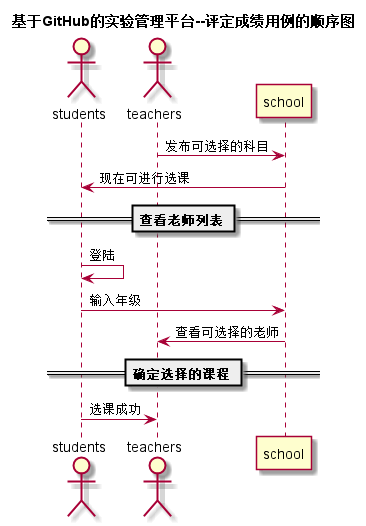

# “选课”用例 [返回](../README.md)
## 1. 用例规约

|用例名称|选课|
|-------|:-------------|
|功能|选课|
|参与者|学生，老师|
|前置条件|必须先登录|
|后置条件|选课成功会提示用户已成功|
|主事件流| 1.老师在系统上发布课程   2.学校确认后，提示学生选课  3.学生选课成功后，提示老师有学生成功选课|
|备选事件流||

## 2. 业务流程
无

## 3. 界面设计
- 界面参照: https://chengrui123456.github.io/is_analysis/test6/ui/顶部菜单.html
- API接口调用
    - 接口1：[getClass](../接口/getClass.md)

## 4. 算法描述 [源码](../src/选课.puml)

    
## 5. 参照表
users
- [USERS](../数据库设计.md/#USERS)
- [STUDENTS](../数据库设计.md/#STUDENTS)
- [GRADES](../数据库设计.md/#GRADES)
- [TESTS](../数据库设计.md/#TESTS)
- [class](../数据库设计.md/#class)
